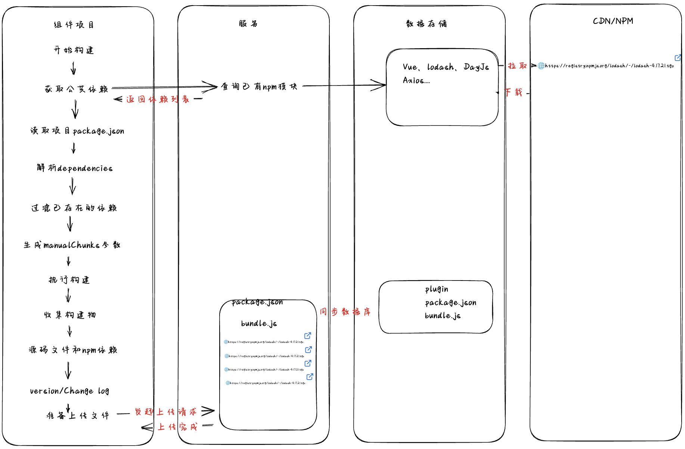

# Vite 库模式打包

## 主流程



## 构建细节

> 在 `Vite+Vue+Ts` 项目的配置文件，将`Vue`组件构建成一个 JavaScript 库。

1. **导入模块和插件：**

   ```javascript
   import { defineConfig } from 'vite'
   import vue from '@vitejs/plugin-vue'
   import dts from 'vite-plugin-dts'
   import { resolve } from 'path'
   import fs from 'fs'
   ```

- `@vitejs/plugin-vue`: Vite 的 Vue 开发插件
- `vite-plugin-dts`: 用于生成 TypeScript 类型定义文件的插件

2. **读取 package.json 文件：**

   ```javascript
   const pkg = fs.readFileSync(resolve(__dirname, './package.json'), { encoding: 'utf-8'})
   const deps = JSON.parse(pkg).dependencies
   ```

   这段代码读取项目根目录下的 `package.json` 文件，解析其中的 `dependencies` 字段，获取项目的依赖关系。

3. **生成 manualChunks 配置：**

   > `manualChunks` 是 Rollup 中的一个配置选项，用于手动指定哪些模块应该被放到一个单独的 chunk 中。在一些情况下，自动代码分割的策略可能无法满足特定的需求，或者需要进行更细粒度的控制时，就可以使用 `manualChunks` 来手动管理模块的划分。

   ```javascript
   const manualChunks = {}

   Object.keys(deps).filter(name => {
     if (/^(@types|vite-plugin)/.test(name) || name === 'vue') {
       return false
     } else {
       return true
     }
   }).forEach(key => {
     manualChunks[key] = [key]
   })
   ```

   - 过滤掉特定的依赖项
     - 以 '@types' 开头的 ts 声明文件
     - 以 'vite-plugin' 开头的 vite 插件
     - vue 源码
   - 生成 `manualChunks` 配置

4. **buildEnd 插件配置：**

   > 构建完成的后置操作

   ```javascript
   const buildEnd = () => {
     return {
       name: 'buildEnd',
       buildEnd() {
         console.log('end')
       }
     }
   }
   ```

   这是一个自定义插件，用于在构建结束后执行一系列的后置操作：

   - package.json 的生成和版本控制
   - 获取远端依赖项
   - 上传构建产物

5. **版本管理及更新日志**

   > 使用 standard-version 自动管理版本号及更新日志

   - 示例 1：新增特性（升级次版本号）
     假设你的提交历史如下：

     ```plaintext
     feat: add new feature A
     ```

     运行 `standard-version` 后，将升级版本号为 `1.1.0`。

   - 示例 2：修复错误（升级补丁版本号）

     假设你的提交历史如下：

     ```plaintext
     fix: fix issue B
     ```

     运行 `standard-version` 后，将升级版本号为 `1.0.1`。

   - 示例 3：不兼容变化（升级主版本号）

     假设你的提交历史如下：

     ```plaintext
     feat: add new feature C
     BREAKING CHANGE: remove old feature D
     ```

     运行 `standard-version` 后，将升级版本号为 `2.0.0`。

   - 示例 4：自定义变更类型

     在 `standard-version` 中，你可以自定义变更类型。假设你的提交历史如下：

     ```plaintext
     custom: add custom change E
     ```

     在 `package.json` 中配置：

     ```json
     {
     "scripts": {
        "release": "standard-version --release-as minor"
     }
     }
     ```

     运行 `npm run release` 后，将升级版本号为 `1.1.0`。

   - 示例 5：手动指定版本号

     如果你希望手动指定版本号，可以运行：

     ```bash
     npm run release -- --release-as 1.2.3
     ```

     这将直接将版本号设置为 `1.2.3`，而不考虑提交历史。
